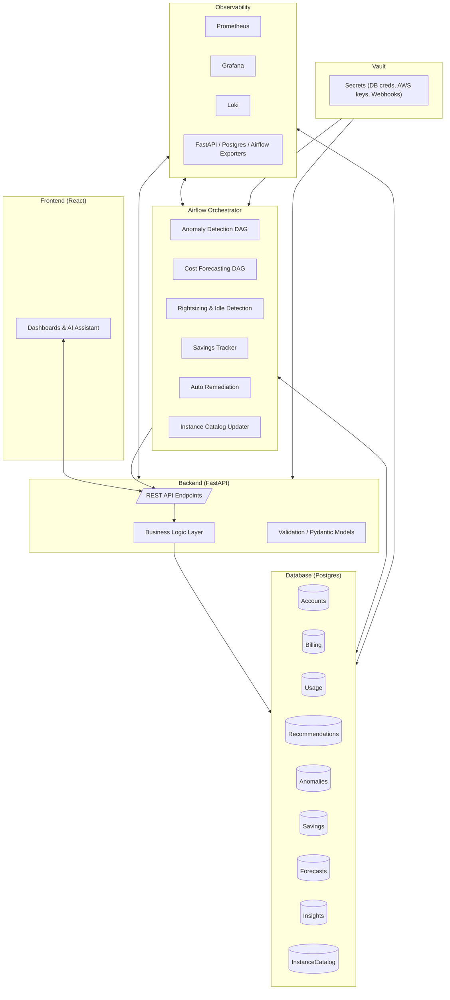

📘 System Architecture
======================

1\. High-Level Overview
-----------------------

Our FinOps platform follows a **modular but integrated architecture** designed for cost governance, anomaly detection, forecasting, and auto-remediation.

It integrates multiple components:

*   **FastAPI backend** (APIs, DB interface, services layer)
    
*   **React frontend** (dashboards, insights, AI assistant)
    
*   **Airflow** (DAGs for automation, scheduling, forecasting, anomaly detection, remediation)
    
*   **Postgres DB** (persistent storage for billing, usage, insights, anomalies, forecasts, recommendations)
    
*   **Vault** (secure secret management)
    
*   **Monitoring stack** (Prometheus + Grafana + Loki + Exporters)
    

2\. Architecture Diagram
------------------------

3\. Data Flow
-------------

1.  **Billing/Usage ingestion**
    
    *   AWS, GCP, Azure data ingested via DAGs → stored in billing & usage.
        
2.  **Analysis**
    
    *   Airflow runs anomaly detection, forecasting, rightsizing.
        
    *   Results are stored in anomalies, forecasts, recommendations.
        
3.  **Insights layer**
    
    *   Backend compiles insights (/api/v1/insights/summary) → frontend dashboards.
        
4.  **Savings validation**
    
    *   savings\_tracker DAG checks applied recommendations → validates savings in savings table.
        
5.  **Auto-remediation**
    
    *   Based on playbooks, anomalies trigger remediation actions → status updated in DB.
        
6.  **Monitoring**
    
    *   Exporters expose metrics. Prometheus scrapes, Grafana visualizes, Loki logs.
        
7.  **AI Assistant**
    
    *   /api/v1/ai/query converts NL → SQL → DB queries for dynamic insights.
        

4\. Deployment Model
--------------------

*   **Containerized** via Docker Compose / Helm
    
*   All components (backend, frontend, airflow, monitoring, vault, DB) orchestrated via Compose
    
*   Ready for Kubernetes (Helm charts planned)
    
*   Secrets flow through **Vault → entrypoint.sh → env vars**
    
*   Airflow DAGs bootstrap automatically on container start
    

5\. Scalability Considerations
------------------------------

*   **Postgres**: Vertical scaling, partitioning for billing tables
    
*   **Airflow**: Can move from LocalExecutor → CeleryExecutor
    
*   **Backend**: Stateless, can scale horizontally
    
*   **Frontend**: Served via Nginx, can use CDN
    
*   **Monitoring**: Prometheus federation for multi-region
    

6\. Security
------------

*   Secrets stored in Vault (not in .env)
    
*   DB connections via SSL
    
*   Webhooks (Slack/Teams) stored in Vault
    
*   Airflow & API behind authentication layer (future: OIDC)
    

7\. Future Enhancements
-----------------------

*   Multi-cloud support (GCP, Azure ingestion pipelines)
    
*   Service mesh (Istio/Linkerd) for traffic control
    
*   RUM (Real User Monitoring) integration for frontend metrics
    
*   Auto-tuning for forecasting model selection
    

8\. Knowledge Check (Questions)
-------------------------------

1.  What are the **main components** of this FinOps architecture?
    
2.  Which **Airflow DAG** is responsible for updating the InstanceCatalog table?
    
3.  How do secrets **flow from Vault → app services**?
    
4.  What role does **Prometheus + Grafana** play in this system?
    
5.  Why is Airflow crucial for automation in this platform?