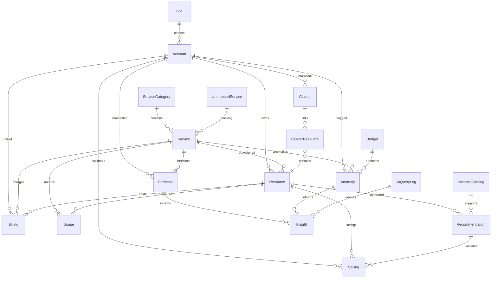

📘 Database Schema
==================

1\. Overview
------------

The FinOps platform uses **PostgreSQL** as its primary data store.We’ve designed the schema to capture **cloud resources, billing, usage, anomalies, recommendations, savings, forecasts, and insights**, all tied together with relationships.

2\. Entity Relationship Diagram (ERD)
-------------------------------------

3\. Tables & Fields
-------------------

### **Accounts**

*   account\_id (PK)
    
*   cloud\_provider (AWS/GCP/Azure)
    
*   account\_number, account\_name
    
*   owner\_email
    
*   created\_at
    

👉 Represents a single cloud account/subscription.

### **Service Categories**

*   category\_id (PK)
    
*   category\_name (Compute, Storage, Networking…)
    
*   description
    

👉 Logical grouping of services.

### **Services**

*   service\_id (PK)
    
*   cloud\_provider, service\_code, service\_name
    
*   category\_id (FK → ServiceCategory)
    

👉 Example: AmazonEC2, AmazonS3.

### **Resources**

*   resource\_id (PK)
    
*   account\_id (FK → Account)
    
*   service\_id (FK → Service)
    
*   resource\_name, resource\_type, region
    
*   tags (JSON)
    
*   created\_at, terminated\_at
    

👉 Represents provisioned units like EC2 instance, S3 bucket.

### **Billing**

*   billing\_id (PK)
    
*   account\_id, service\_id, resource\_id
    
*   usage\_date
    
*   cost\_amount, currency
    
*   usage\_type, usage\_quantity, pricing\_unit
    
*   metadata (JSON)
    

👉 Daily cloud bill entries.

### **Usage**

*   usage\_id (PK)
    
*   resource\_id
    
*   metric\_name (CPUUtilization, Memory, Invocations…)
    
*   metric\_value, unit
    
*   collected\_at, created\_at
    

👉 Observability data for resources.

### **Clusters & ClusterResources**

*   cluster\_id (PK), account\_id, cluster\_name, cluster\_type, region
    
*   cluster\_resources (junction table: cluster\_id + resource\_id)
    

👉 Groups resources under clusters (EKS, AKS, GKE).

### **Recommendations**

*   rec\_id (PK)
    
*   resource\_id
    
*   rec\_type (Idle, Rightsize)
    
*   current\_config, recommended\_config (JSON)
    
*   estimated\_savings, currency
    
*   created\_at, status (pending/applied/validated)
    

👉 Generated by rightsizing DAG.

### **Anomalies**

*   anomaly\_id (PK)
    
*   account\_id, service\_id
    
*   metric, observed\_value, expected\_value, deviation\_percent
    
*   detected\_at, details (JSON)
    

👉 Cost/usage anomalies detected.

### **Savings**

*   saving\_id (PK)
    
*   account\_id, resource\_id, rec\_id
    
*   implemented\_at, actual\_savings, currency
    

👉 Validates whether applied recommendations → real savings.

### **Forecasts**

*   forecast\_id (PK)
    
*   account\_id, service\_id
    
*   forecast\_period\_start, forecast\_period\_end
    
*   forecast\_amount, currency
    
*   model\_used, confidence\_interval (JSON)
    
*   generated\_at
    

👉 Cost prediction for 30/90/180 days.

### **Insights**

*   insight\_id (PK)
    
*   account\_id, service\_id
    
*   insight\_type (trend, anomaly, savings, forecast\_gap)
    
*   severity, message, metadata (JSON)
    
*   created\_at
    

👉 Powers dashboards.

### **Instance Catalog**

*   id (PK)
    
*   family, size, vcpu, memory, storage, network\_performance, generation, pricing
    
*   last\_updated
    

👉 Synced weekly via AWS Pricing API.

### **Budgets**

*   budget\_id (PK)
    
*   account\_id, service\_id
    
*   budget\_name, budget\_limit, currency
    
*   created\_at
    

👉 Budget definitions; breaches → anomalies.

### **Logs**

*   log\_id (PK)
    
*   timestamp, level, component, message
    
*   correlation\_id, user\_id, extra (JSON)
    

👉 For observability and debugging.

### **Unmapped Services**

*   id (PK)
    
*   cloud\_provider, service\_name, first\_seen, last\_seen
    

👉 Tracks services not yet mapped into services.

### **AI Queries Log**

*   log\_id (PK)
    
*   query\_text
    
*   created\_at
    
*   status (supported / unsupported)
    

👉 Tracks AI Assistant queries.

4\. Data Lifecycle Example
--------------------------

**Example: EC2 Rightsizing**

1.  Usage data (CPUUtilization) stored in usage.
    
2.  Rightsizing DAG analyzes usage → recommendation saved in recommendations.
    
3.  If applied, tracked by savings.
    
4.  Insights updated in insights.
    
5.  Dashboards show savings + utilization trends.
    

5\. Knowledge Check (Questions)
-------------------------------

1.  Which tables directly feed **anomaly detection**?
    
2.  What’s the role of **InstanceCatalog** in rightsizing?
    
3.  How does **Savings** validate recommendations?
    
4.  Which table logs **AI assistant queries**?
    
5.  What’s the relationship between **Billing** and **Usage**?