# LLM Usage in ai_service.py

## Overview
The AI Query Service (`ai_service.py`) powers natural language (NL) queries in Samaira.
It supports a **hybrid approach**:

1. **YAML Queries** → Fast, deterministic lookups from `ai_queries.yaml`.
2. **LLM Fallback** → Flexible SQL generation via OpenAI, Anthropic, or Ollama (local).
3. **Guardrails** → Ensure only safe `SELECT` queries run.
4. **Logging** → Store all queries in `ai_queries_log` for auditing and model retraining.

---

## Architecture (Component View)

```plantuml
@startuml
title Samaira AI Query Flow (YAML + LLM Fallback)

actor User as U
participant "API (FastAPI)" as API
participant "AI Service" as Service
database "Postgres" as DB
participant "LLM Adapter" as LLM
database "ai_queries_log" as Log

U --> API : /api/v1/ai/query?q="user question"
API --> Service : process_query(nl_query)

alt Match in ai_queries.yaml
    Service -> DB : Execute SQL (YAML)
    Service --> Log : status="yaml"
    Service --> API : Return results

else No YAML match
    alt USE_LLM_FALLBACK=true
        Service -> LLM : generate_sql(nl_query, schema)
        alt Valid + Safe SQL
            Service -> DB : Execute SQL (LLM)
            Service --> Log : status="llm" or "ollama"
            Service --> API : Return results
        else Unsafe SQL
            Service --> Log : status="unsafe"
            Service --> API : "🚫 Unsafe query blocked"
        end
    else USE_LLM_FALLBACK=false
        Service --> Log : status="unsupported"
        Service --> API : "❓ Query not supported"
    end
end

@enduml
```



---

## Sequence Flow (Hybrid NL → SQL Engine)


---

## Guardrails

- Only allow `SELECT` queries (`is_safe_sql` check).
- Auto-add `LIMIT 100` if missing.
- Block `DROP`, `DELETE`, `UPDATE`, `INSERT`, `ALTER`.

```python
def is_safe_sql(sql: str) -> bool:
    parsed = sqlparse.parse(sql)
    for stmt in parsed:
        if stmt.get_type() != "SELECT":
            return False
    return True
```

---

## Logging

All queries are logged in `ai_queries_log`:

| id | query_text          | sql_generated     | status       | created_at |
|----|---------------------|------------------|--------------|------------|
| 1  | "top services"      | SELECT ...       | yaml         | 2025-09-15 |
| 2  | "show me EC2 spend" | SELECT ...       | llm          | 2025-09-15 |
| 3  | "delete billing"    | DELETE ...       | unsafe       | 2025-09-15 |
| 4  | "random question"   | NULL             | unsupported  | 2025-09-15 |
| 5  | "forecast usage"    | SELECT ...       | ollama       | 2025-09-15 |
| 6  | "LLM failed test"   | NULL             | llm_failed   | 2025-09-15 |

Statuses: `yaml | llm | ollama | unsafe | unsupported | llm_failed`

---

## Observability

- Prometheus metric: `finops_ai_queries_total{status="llm"}`
- Grafana dashboards:
  - Pie chart: YAML vs LLM vs Ollama
  - Line chart: queries per day
  - Table: top queries

---

## Configuration

`.env` example:

```ini
USE_LLM_FALLBACK=true

# Primary provider
LLM_PROVIDER=openai
LLM_MODEL=gpt-4o-mini
LLM_API_KEY=sk-xxxx

# To use Anthropic
# LLM_PROVIDER=anthropic
# LLM_MODEL=claude-3.5-sonnet

# To use Ollama (local model in Docker)
# LLM_PROVIDER=ollama
# LLM_MODEL=llama3
```

---

## Summary

- **Step 1:** Match NL query in YAML → deterministic SQL.  
- **Step 2:** If not found, use LLM fallback (OpenAI/Anthropic/Ollama).  
- **Step 3:** Guardrails prevent unsafe SQL.  
- **Step 4:** Log everything in `ai_queries_log`.  
- **Step 5:** Expose metrics to Prometheus + Grafana.

This makes Samaira a conversational FinOps assistant: safe, explainable, and extensible.

---
