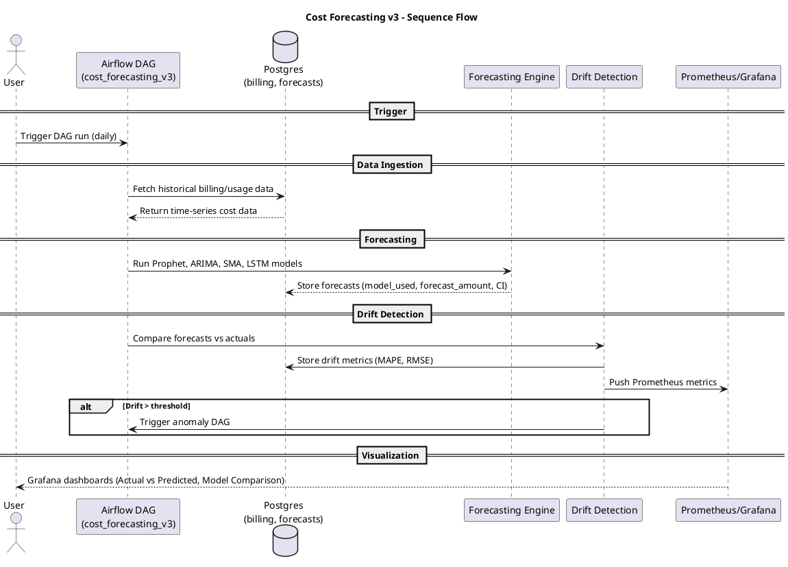

# Cost Forecasting v3 Documentation

## Overview
Cost Forecasting v3 extends the previous pipeline (Prophet + ARIMA + SMA) by adding:

- **LSTM (deep learning)** for sequential cost prediction.
- **Forecast drift detection** using MAPE/RMSE metrics.
- **Observability** via Prometheus + Grafana.
- **Ensemble comparison** of Prophet, ARIMA, SMA, LSTM forecasts.

The goal is to provide more accurate, reliable, and observable FinOps cost forecasts.

---

## Architecture (Component View)

```plantuml
@startuml
title Samaira Cost Forecasting v3 – Multi-Model + Drift Detection

actor User as U
participant "Airflow DAG (cost_forecasting_v3)" as DAG
database "Postgres (billing, forecasts)" as DB

rectangle "Forecasting Engine" as Engine {
  component "Prophet"
  component "ARIMA"
  component "SMA"
  component "LSTM"
}

rectangle "Metrics & Drift Detection" as Drift {
  component "MAPE/RMSE Calculation"
  component "Drift Alerting"
}

rectangle "Observability Stack" as Obs {
  component "Prometheus"
  component "Grafana"
}

== Data Ingestion ==
U -> DAG : Trigger daily forecast job
DAG -> DB : Fetch billing/usage history

== Forecasting ==
DB --> Engine : Historical cost data
Engine --> DB : Store forecasts (Prophet, ARIMA, SMA, LSTM)

== Drift Detection ==
DB --> Drift : Compare forecasts vs actuals
Drift -> Obs : Push metrics (forecast_accuracy, forecast_drift)
Drift -> DAG : Trigger anomaly DAG if drift > threshold

== Visualization ==
Obs --> U : Grafana dashboards (Actual vs Predicted, Model Comparison)

@enduml
```

---

## Sequence Flow (DAG Execution)



---

## Database Updates

Forecasts are stored in the `forecasts` table with:

- `forecast_id`
- `account_id`
- `service_id`
- `forecast_period_start`
- `forecast_period_end`
- `forecast_amount`
- `currency`
- `model_used` → Prophet | ARIMA | SMA | LSTM
- `confidence_interval`

Drift metrics are stored in Prometheus and can optionally be added to a new table `forecast_drift`.

---

## Observability

- Prometheus metrics:
  - `finops_forecast_drift{model="LSTM"}`
  - `finops_forecast_accuracy{model="Prophet"}`
- Grafana dashboards:
  - Overlay chart: Actual vs Forecasted
  - Model comparison table: Prophet, ARIMA, SMA, LSTM
  - Drift detection alerts (MAPE > 20%)

---

## Next Steps

1. Implement `cost_forecasting_v3.py` DAG.
2. Train LSTM model daily with rolling window data.
3. Compare models, log drift.
4. Push metrics to Prometheus → Grafana.
5. Document results in GitBook.

---

